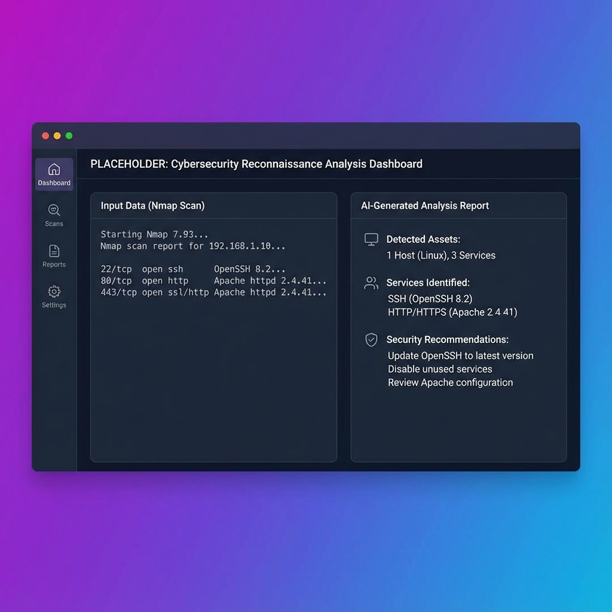

# 🕵️ AI Recon Mapper v1.0

<div align="center">


**Análisis profesional de reconocimiento de ciberseguridad con IA**

[](https://opensource.org/licenses/MIT)
[](https://www.python.org/downloads/)
[](https://streamlit.io)
[](https://openai.com)

[Características](#-características) •
[Instalación](#-instalación) •
[Uso](#-uso) •
[Arquitectura](#-arquitectura) •
[Roadmap](#-roadmap) •
[Contribuir](#-contribuir)

</div>

---

## 📋 Descripción

**AI Recon Mapper** es una herramienta profesional que utiliza inteligencia artificial para analizar resultados de reconocimiento de ciberseguridad. Diseñada tanto para principiantes como para profesionales, proporciona análisis detallados, educativos y accionables de escaneos de red, consultas DNS, WHOIS y más.

### 🎯 ¿Qué hace?

- **Analiza** resultados de herramientas de reconocimiento (Nmap, WHOIS, DNS, etc.)
- **Identifica** activos (IPs, dominios, subdominios, puertos, servicios)
- **Detecta** tecnologías y versiones de software
- **Evalúa** posibles riesgos de seguridad (enfoque educativo)
- **Explica** hallazgos en lenguaje claro y accesible
- **Recomienda** recursos de aprendizaje y mejores prácticas

### ⚠️ Importante

Esta herramienta **NO ejecuta escaneos** ni realiza reconocimiento activo. Solo analiza el texto que proporcionas.

---

## ✨ Características

### 🤖 Análisis con IA
- **Múltiples modelos**: GPT-4o-mini, GPT-4o, GPT-4-turbo, GPT-3.5-turbo
- **Modos adaptativos**: Junior (principiantes) y Expert (profesionales)
- **Prompt engineering avanzado**: Salidas estructuradas y consistentes

### 📊 Detección Inteligente
- **Auto-detección** de tipo de datos (Nmap, WHOIS, DNS, Mixto)
- **Extracción automática** de IPs, dominios y puertos
- **Estadísticas en tiempo real** del texto analizado

### 🎨 Interfaz Profesional
- **Diseño moderno** con gradientes y componentes estilizados
- **Sidebar configurable** con opciones avanzadas
- **Layout responsivo** de dos columnas
- **Feedback visual** con spinners y métricas

### 🔧 Configuración Avanzada
- **Control de temperatura**: Ajusta la creatividad de las respuestas
- **Límite de tokens**: Controla la longitud de la salida
- **Estimación de costes**: Calcula el coste de cada análisis

### 🛡️ Seguridad y Ética
- **Protección de API keys** via variables de entorno
- **Validación de entrada** y manejo de errores
- **Avisos legales** y restricciones éticas
- **Enfoque educativo** sin instrucciones de explotación

---

## 🚀 Instalación

### Prerrequisitos

- **Python 3.8 o superior**
- **API key de OpenAI** ([obtener aquí](https://platform.openai.com/api-keys))

### Pasos

1. **Clonar el repositorio:**
```bash
git clone https://github.com/yourusername/ai-recon-mapper.git
cd ai-recon-mapper
```

2. **Crear entorno virtual:**
```bash
python -m venv venv
```

3. **Activar entorno virtual:**

**Windows:**
```bash
venv\Scripts\activate
```

**Linux/Mac:**
```bash
source venv/bin/activate
```

4. **Instalar dependencias:**
```bash
pip install -r requirements.txt
```

5. **Configurar API key:**

Crea un archivo `.env` en la raíz del proyecto:
```env
OPENAI_API_KEY=tu_api_key_aqui
```

O configura la variable de entorno:

**Windows (PowerShell):**
```powershell
$env:OPENAI_API_KEY="tu_api_key_aqui"
```

**Linux/Mac:**
```bash
export OPENAI_API_KEY="tu_api_key_aqui"
```

6. **Ejecutar la aplicación:**
```bash
streamlit run src/app.py
```

La aplicación se abrirá en `http://localhost:8501`

---

## 💻 Uso

### Interfaz Principal

1. **Pega tus datos** en el área de texto de la izquierda
2. **Configura opciones** en el panel lateral:
   - Modelo de IA
   - Nivel de experiencia (Junior/Expert)
   - Tipo de datos
   - Configuración avanzada (opcional)
3. **Haz clic** en "Analizar con IA"
4. **Revisa el análisis** en la columna derecha

### Ejemplos de Datos

#### Escaneo Nmap
```
Starting Nmap 7.80 ( https://nmap.org )
Nmap scan report for example.com (93.184.216.34)
Host is up (0.015s latency).

PORT     STATE SERVICE    VERSION
22/tcp   open  ssh        OpenSSH 7.9p1
80/tcp   open  http       nginx 1.18.0
443/tcp  open  ssl/https  nginx 1.18.0
3306/tcp open  mysql      MySQL 5.7.32
```

#### Consulta WHOIS
```
Domain Name: EXAMPLE.COM
Registry Domain ID: 2336799_DOMAIN_COM-VRSN
Registrar: IANA
Creation Date: 1995-08-14T04:00:00Z
Expiry Date: 2024-08-13T04:00:00Z
Name Server: A.IANA-SERVERS.NET
```

#### DNS Lookup
```
Server:  192.168.1.1
Address:  192.168.1.1#53

Non-authoritative answer:
Name:    example.com
Address: 93.184.216.34
```

### Capturas de Pantalla


*Interfaz principal con análisis en tiempo real*

---

## 🏗️ Arquitectura

### Estructura del Proyecto

```
ai-recon-mapper/
├── src/
│   ├── app.py                 # Aplicación principal Streamlit
│   ├── ai/
│   │   ├── analyzer.py        # Motor de análisis con OpenAI
│   │   └── prompts.py         # Plantillas de prompts
│   └── utils/
│       ├── parser.py          # Parsing y extracción de datos
│       └── helpers.py         # Funciones auxiliares
├── assets/
│   └── screenshots/
│       └── placeholder.png    # Capturas de pantalla
├── .gitignore
├── LICENSE
├── README.md
├── requirements.txt
└── CHANGELOG.md
```

### Módulos Principales

#### `src/app.py`
- Interfaz de usuario Streamlit
- Gestión de estado y sesión
- Layout y componentes visuales

#### `src/ai/analyzer.py`
- Clase `ReconAnalyzer` para análisis con IA
- Integración con OpenAI API
- Estimación de costes y uso de tokens

#### `src/ai/prompts.py`
- Prompts del sistema (Junior/Expert)
- Plantillas de análisis estructurado
- Funciones de construcción de prompts

#### `src/utils/parser.py`
- Limpieza y normalización de texto
- Detección automática de tipo de datos
- Extracción de IPs, dominios y puertos

#### `src/utils/helpers.py`
- Formateo de mensajes
- Validación de entrada
- Utilidades generales

---

## 📊 Características Técnicas

### Modelos Soportados
- **GPT-4o-mini** (Recomendado) - Rápido y económico
- **GPT-4o** - Máxima calidad
- **GPT-4-turbo** - Balance calidad/velocidad
- **GPT-3.5-turbo** - Económico

### Modos de Análisis

#### 🎓 Modo Junior
- Explicaciones detalladas
- Definición de términos técnicos
- Contexto adicional
- Recursos de aprendizaje
- Analogías y ejemplos

#### 🎯 Modo Expert
- Análisis conciso
- Enfoque en hallazgos críticos
- Profundidad técnica
- Referencias a CVEs
- Herramientas avanzadas

### Tipos de Datos Soportados
- **Nmap**: Escaneos de puertos y servicios
- **WHOIS**: Información de dominios
- **DNS**: Registros DNS (A, MX, TXT, etc.)
- **Mixto**: Combinación de múltiples fuentes

---

## 💰 Costes

La aplicación utiliza la API de OpenAI, que tiene un coste por uso:

| Modelo | Entrada (por 1M tokens) | Salida (por 1M tokens) |
|--------|-------------------------|------------------------|
| GPT-4o-mini | $0.150 | $0.600 |
| GPT-4o | $2.50 | $10.00 |

**Coste típico por análisis:** $0.001 - $0.01 USD

La aplicación muestra estimaciones de coste en tiempo real.

---

## 🗺️ Roadmap

### v1.1 (Próximamente)
- [ ] Exportar análisis a PDF/Markdown
- [ ] Historial de análisis
- [ ] Comparación de múltiples escaneos
- [ ] Modo oscuro

### v1.2
- [ ] Visualizaciones gráficas
- [ ] Análisis batch
- [ ] Integración con VirusTotal
- [ ] Integración con Shodan

### v2.0
- [ ] Autenticación de usuarios
- [ ] Base de datos para almacenamiento
- [ ] API REST
- [ ] Dashboard de métricas

---

## 🤝 Contribuir

¡Las contribuciones son bienvenidas! Si quieres mejorar AI Recon Mapper:

1. **Fork** el repositorio
2. **Crea** una rama para tu feature (`git checkout -b feature/AmazingFeature`)
3. **Commit** tus cambios (`git commit -m 'Add some AmazingFeature'`)
4. **Push** a la rama (`git push origin feature/AmazingFeature`)
5. **Abre** un Pull Request

### Áreas de Contribución
- 🐛 Reportar bugs
- 💡 Sugerir nuevas características
- 📝 Mejorar documentación
- 🎨 Mejorar diseño UI/UX
- 🔧 Optimizar código

---

## ⚖️ Aviso Legal

Esta herramienta es **exclusivamente educativa** y debe utilizarse únicamente con fines de aprendizaje en ciberseguridad.

### ✅ Uso Permitido
- Análisis de tus propios sistemas
- Laboratorios de práctica autorizados
- Entornos de prueba con permiso explícito
- Fines educativos y de aprendizaje

### ❌ Uso Prohibido
- Reconocimiento no autorizado de sistemas de terceros
- Análisis de infraestructuras sin permiso
- Actividades ilegales o no éticas
- Explotación de vulnerabilidades sin autorización

**El usuario es el único responsable del uso de esta herramienta.** El uso indebido puede ser ilegal según las leyes de tu jurisdicción.

---

## 📄 Licencia

Este proyecto está licenciado bajo la Licencia MIT - ver el archivo [LICENSE](LICENSE) para más detalles.

---

## 📞 Soporte

Si encuentras problemas o tienes preguntas:

1. Revisa la [documentación](#-uso)
2. Consulta el [CHANGELOG](CHANGELOG.md)
3. Abre un [Issue](https://github.com/yourusername/ai-recon-mapper/issues)

---

<div align="center">

PIRE

⭐ Si te gusta este proyecto, dale una estrella en GitHub ⭐

</div>
